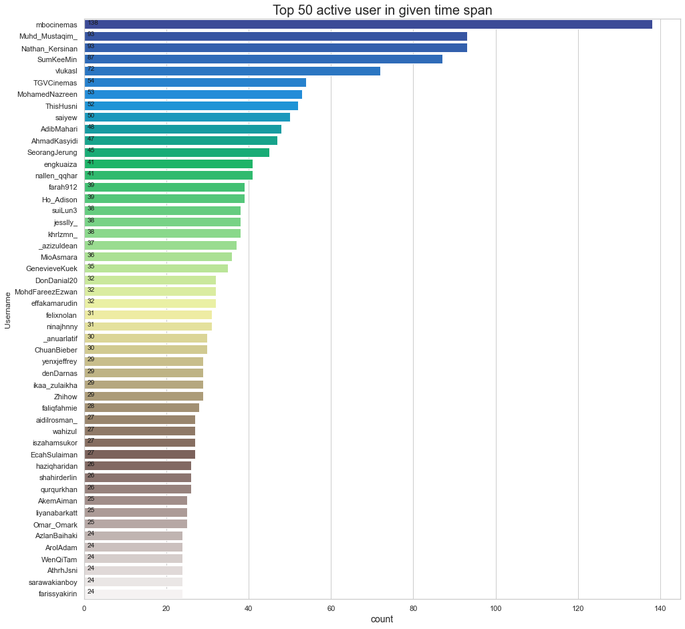
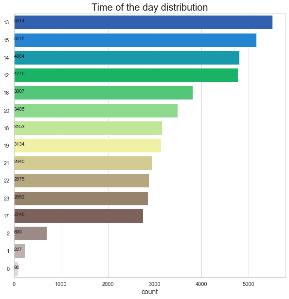
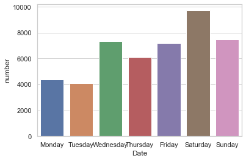

# Cinema Popularity in Malaysia #

## Project Goal
The goal of the project is to understand this dataset, get some insights from it, and to improve my data analysis/manipulation skill set using Python. Personally, I would like to see which day of the week and at which hour cinemas is most mentioned on Twitter.

## Data Source
I retrieved data about cinemas in Malaysia from Twitter using Twitter Scraper package. 

## Data Description
This dataset have the top 4 cinema operators in Malaysia as a data point (47569 tweets in total), and for each, we have 21 columns, each column represents a different aspect or measure of the specific tweet.

### Top 50 users that tweet about cinema in 10 years

Here we can see that MBOcinemas hired a really active social media manager!

Figure 2. Top 50 twitter users tweeting about cinemas 

-------------------------------------------

### Time of day distribution 

Figure 1. What time of the day Malaysians tweets about cinemas. 

-------------------------------------------

### Which day of the week is the best time to go to the cinemas

Figure 3. Best day of the week to go to the cinemas 

-------------------------------------------

# Conclusion 

Data was scraped using Twitterscraper, data cleaning and manipulation were performed. Finally, the data was visualized using matplotlib and Seaborn 

<!-- # Future work 

Conducting sentiment analysis using VaderSentiment python package or build my earn sentiment analyzer using Machine learning models. 

Once I learn more about maching learning methods such as linear/logistic regression, naive bayes, decision tress, and linear support vector machine I can find fit and run the models -->
